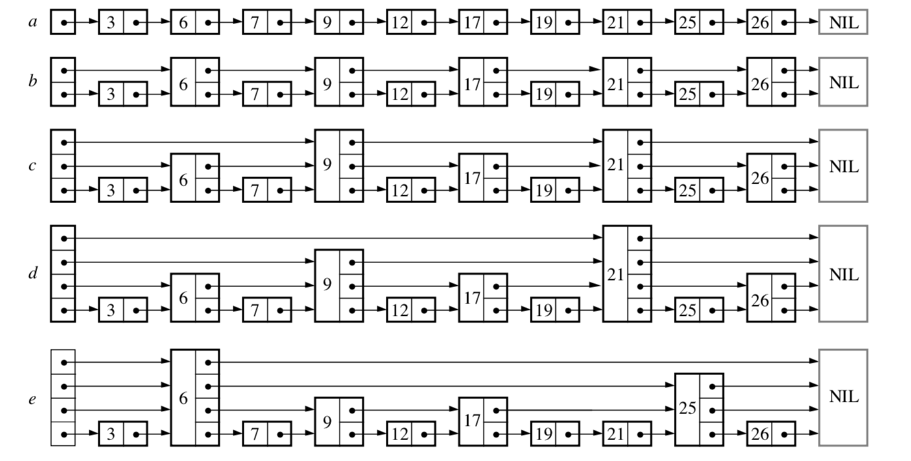

跳跃表论文学习和Golang实现。

[Skip Lists: A Probabilistic Alternative to Balanced Trees](https://epaperpress.com/sortsearch/download/skiplist.pdf).

<!--more-->

# 跳跃表学习

## 跳跃表出现的目的

首先看一下下面的图，对于一个排序链表，如果搜索的结果是当前链表的最大值，那么需要搜索到结尾才能找到值，那么如何优化这个查找效率呢？

首先我们假设一个链表长度为 $n$ 且搜索的值假设是当前链表最大的值。

如上图中的 $a$ 所展示的一样，搜索最后一个值需要搜寻的节点个数为 $\left[ n/2 \right]$ 搜索个数直接减少为 $1/2$ 

那么构建更多的索引链表，可以让搜索的节点个数变得更少，这就是跳跃表出现的原因。

## 跳跃表查询

## 跳跃表插入和删除

# 跳跃表实现
